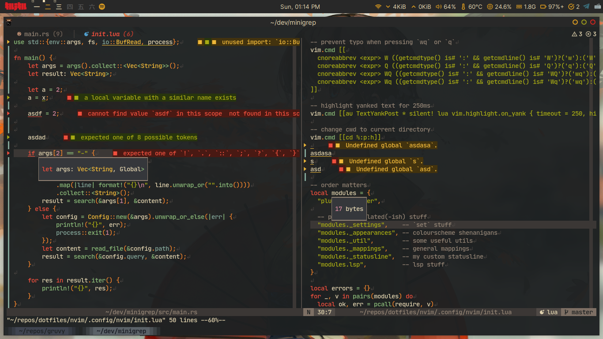

# gruvy.nvim

---

My own variation of gruvbox dark made with [lush.nvim](https://github.com/rktjmp/lush.nvim).

This is intended for my own personal usage and I don't plan to please everyone :p

Feel free to use it though.

Here's a temporary screenshot which probably going to be outdated soon.

